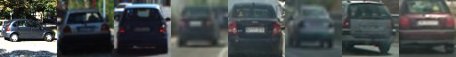
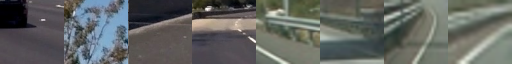
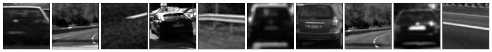
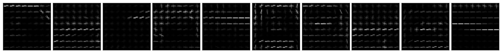
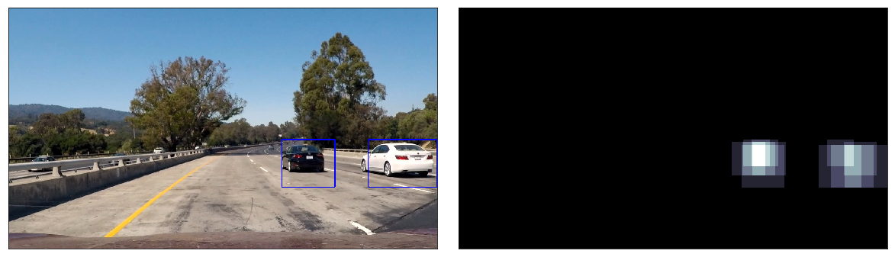
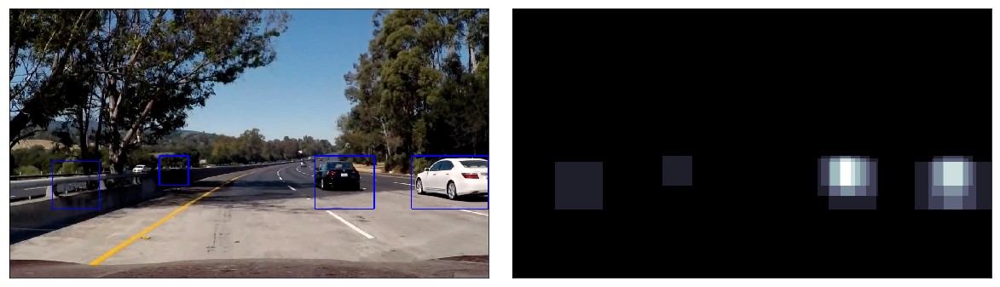

# CarND-Vehicle-Detection-and-Tracking
Udacity CarND Vehicle Detection and Tracking Project

The goal of this project is to reliably identify the location of vehicles in a video stream of a front facing camera mounted centraly in a moving vehicle.

  

## Project Structure

- `test_images/` Directory with images to test vechicle identification
- `examples/` Directory with example images used in the writeup
- `videos/` Directory with input and output videos
- `Vehicle-Detection-and-Tracking.ipnyb` Jupyter notebook with all the project code and example images
- `README.md` Projecte writeup (you're reading it)

## Project Overview

- **Reading Labeled Data** - We start by reading in the labeled data provided

- **Feature Extraction** - We then extract the desired features

- **Scalling Features** - We continue by scalling these features

- **Training the Classifier** - We train the classifier: a Linear Support Vector Classification, or SVC

- **Detecting Vehicles** - We use the previsouly trained classifier to identify vehicles in a video stream

- **Video Augmentation** - We finaly augment the video with the vehicles detected within rectangles

## Reading Labeled Data

We start by reading and analysing the provided data, this is separated into [`vechicles`](https://s3.amazonaws.com/udacity-sdc/Vehicle_Tracking/vehicles.zip) and [`non-vehicles`](https://s3.amazonaws.com/udacity-sdc/Vehicle_Tracking/non-vehicles.zip) data. The data set included **8792** examples of vehicle images and **8968** examples of non vehicle images.

Here's an example of the dataset:

> Vehicles



> Non Vehicles




## Feature Extraction

We then proceed to extract the required features from the dataset.

To achieve this I used a class, `ExtractFeatures` that abstracts away the feature identification, extraction and concatenation.

In this case we choose to extract 3 features, **spatial information**, **Histogram of Oriented Gradients (HOG** for short) and **color channel histogram**, all using **YCbCr color space**. 

```python
self.img = cv2.cvtColor(img, cv2.COLOR_RGB2YCrCb)
```

```python
def features(self, x=0, y=0, s=64):
    """Returns a vector of the concatenated features"""
    features = []
    # Add spactial features
    spatial = self._bin_spatial(self.img[y:y + s, x:x + s, :])
    features.append(spatial)
    # Add HOG features 
    hog = self._hog(x, y, s)
    features.append(hog)
    # Add Histogram features
    hist = self._color_hist(self.img[y:y + s, x:x + s, :])
    features.append(hist)
    # Finally concatente them all and return
    return np.concatenate(features)
```

### Spacial Information

We simply resize and convert the image to a single dimension vector

```python
spacial_vector = cv2.resize(img, size).ravel()
```

### HOG, or Histogram of Oriented Gradients

After a certain amount of experimentation, where we trained and evaluated the classifier with diferent combinations of parameters, found a reasonably combination which produced high levels of accuracy and finally tested training the classifier multiple times until we reached an average accuracy of **98.9%**. 

This resulted in a **HOG** with:
 - `10` orientations
 - `8` pixels per cell
 - `2` cells per block
 
We used the `hog` function from `skimage.feature` like so: 

 ```python
 from skimage.feature import hog
 
 for channel in range(self.depth):
    hog_feature = hog(self.img[:, :, channel], 
                      orientations=10, 
                      pixels_per_cell=(8, 8),
                      cells_per_block=(2, 2), 
                      transform_sqrt=True, 
                      visualise=False,
                      feature_vector=False)
    self.features_hog.append(hog_feature)
```

We were then capable of getting features for individual areas of the image by calculating the HOG offsets, horizontal offset `x`, vertical `y` and the side of the square area `s`.

```python
_x = max((x // 8) - 1, 0)
_y = max((y // 8) - 1, 0)
_s = (s // 8) - 1

if (_x + _s) > self.features_hog.shape[2]:
    _x = self.features_hog.shape[2] - _s
    
if (_y + _s) > self.features_hog.shape[1]:
    _y = self.features_hog.shape[1] - _s

hog_region_features = np.ravel(self.features_hog[:, _y:_y + _s, _x:_x + _s, :, :, :])
```
 
 Here's an example of the HOG applied to a random dataset
 
 > Original: Y channel on YCbCr color space
 

 
 > HOG
 

 

### Color Channel Histogram

Finally we separate individual color channels using `numpy` `histogram` function, using **16** bins and a range of **(0, 256)**

```python
# Compute the histogram of the color channels separately
channel1_hist = np.histogram(img[:,:,0], bins=nbins, range=bins_range)
channel2_hist = np.histogram(img[:,:,1], bins=nbins, range=bins_range)
channel3_hist = np.histogram(img[:,:,2], bins=nbins, range=bins_range)
# Concatenate the histograms into a single feature vector
hist_features = np.concatenate((channel1_hist[0], channel2_hist[0], channel3_hist[0]))
```

> For full implementation details please see the [jupyter notebook](Vehicle-Detection-and-Tracking.ipynb)

## Scalling Features

We scale the features using `sklearn.preprocessing` `StandardScaler`. This allows us standardize the features by removing the mean and scalling to single varience.

Standardization of a dataset is a common requirement for many machine learning estimators: they might behave badly if the individual feature do not more or less look like standard normally distributed data.

```python
from sklearn.preprocessing import StandardScaler

X_scaler = StandardScaler().fit(X)
scaled_X = X_scaler.transform(X)
y = np.hstack((np.ones(len(vehicle_features)), np.zeros(len(non_vehicle_features))))
```

## Training the Classifier

For classifier we've chosen a **Linear Support Vector Classification**. 

This classifier gives us very good results for this dataset having achieved an accuray of around **99%**

We've also seperated the **training** and **testing** data in a **80/20** fashion.

To implement the classifier we've used `sklearn.svm` `LinearSVC` class.

```python
from sklearn.svm import LinearSVC
from sklearn.model_selection import train_test_split

X_train, X_test, y_train, y_test = train_test_split(scaled_X, y, test_size=0.2, random_state=43)
linear_svc = LinearSVC()
linear_svc.fit(X_train, y_train)
accuracy = round(linear_svc.score(X_test, y_test), 5)
print('Classifier Accuracy: {}'.format(accuracy))
```

## Detecting Vehicles

To finally detect the vehicles in the images we used a sliding window approch. 

To improve its performance we aproximated the vehicle location and size in diferent areas of the image. 
In the region closer to the bonet, lower in the image, we use a larger window size, as opposed to a region further away, or higher in the image, where we can approximate that the vehicles will be smaller. 

The diference in size is between **80%** and **30%** of the original frame size.

```python
def _sliding_window_pass(self, img):
    scales = np.array([0.3, 0.5, 0.65, 0.8])
    y_top  = np.array([0.6, 0.57, 0.56, 0.55])

    img_detections = np.empty([0, 4], dtype=np.int64)

    for scale, y in zip(scales, y_top):
        scale_detections = self._scale_and_apply_classifier(img, scale, y, 64)
        img_detections = np.append(img_detections, scale_detections, axis=0)

    detections, self.heatmap = self._merge_detections(img_detections, img.shape, threshold=1)

    self.history.append(detections)
```

Here we scale and apply our classifier to identify the vehicles in the image.

```python
def _scale_and_apply_classifier(self, img, scale, y, k):
    (height, width, depth) = img.shape
    scaled = resize((img / 255.0).astype(np.float64),
                    (int(height * scale), int(width * scale), depth),
                    preserve_range=True).astype(np.float32)

    features_extractor = ExtractFeatures(scaled)
    (height, width, depth) = scaled.shape
    # Placeholder for detections
    detections = np.empty([0, 4], dtype=np.int)

    y = int(height * y)
    s = k // 3
    x_range = np.linspace(0, width - k, (width + s) // s)

    for x in x_range.astype(np.int):
        features = features_extractor.features(x, y, k)
        features = self.scaler.transform(np.array(features).reshape(1, -1))

        if self.classifier.predict(features)[0] == 1:
            detections = np.append(detections, [[x, y, x + k, y + k]], axis=0)

    return (detections / scale).astype(np.int)

```

To implemente the vehicle detection we've create a class, `VehicleDetector`, that abstract away the sliding window analysis and allows us to simply `run` our vehicle detection and return the image with the detection "box" overlayed.

Here's an example of the image with the vehicles identified and the corresponding heatmap



> For full implementation details please see the [jupyter notebook](Vehicle-Detection-and-Tracking.ipynb)

## Video Augmentation

In order to avoid false positives we can use the fact that the images are an ordered sequence and take advantage of the knowladge of previous **N** frames vehicle location to estimate if it's an actual vehicle or a false positive.
We can then remove the false positives. 

```python
def _detections_last_n_frames(self):
    detections, _ = self._merge_detections(
        np.concatenate(np.array(self.history)),
        self.img_shape,
        threshold=min(len(self.history), 15)
    )
    return detections

def _merge_detections(self, detections, img_shape, threshold):
    heatmap = np.zeros((img_shape[0], img_shape[1])).astype(np.float)
    heatmap = self._add_heatmap(heatmap, detections)

    # Apply threshold to remove false positives
    heatmap[heatmap < threshold] = 0
    heatmap = np.clip(heatmap, 0, 255)

    labels = label(heatmap)
    vehicles = np.empty([0, 4], dtype=np.int64)

    # for each detected vehicle:
    for vehicle in range(1, labels[1] + 1):
        nonzero = (labels[0] == vehicle).nonzero()
        nonzero_min_max = [[np.min(nonzero[1]), np.min(nonzero[0]),
                            np.max(nonzero[1]), np.max(nonzero[0])]]
        vehicles = np.append(vehicles, nonzero_min_max, axis=0)

    return (vehicles, heatmap)

def _add_heatmap(self, heatmap, detections):
    for d in detections:
        heatmap[d[1]:d[3], d[0]:d[2]] += 1

    return heatmap
```


Here's an example of the image with the vehicles identified and the corresponding heatmap, clearly showing false positives



> For full implementation details please see the [jupyter notebook](Vehicle-Detection-and-Tracking.ipynb)


## Discussion

The augmented video can be found [here](videos/project_video_augmented.mp4) and it clearly identifies the 2 vehicles that appear in the video. However it took too long to produce and could not be used in a real time, live, video stream, for that we would have to optimize the pipeline. 

I've also applied the vehicle detection to the video from the previous project, [Advanced Lane Finding](https://github.com/ricardosllm/CarND-Advanced-Lane-Finding) and it performs pretty much the same.


This is still a very naive approch as it only works in ideal conditions. Changes in weather conditions, time of day and other factors would most likely result in a failure to identify other vehicles in the road and potentially cause an accident.

It gives us a good starting point and a glimpse of what computer vision alone can accomplish with a few lines of code but it's not by any means production ready. 
